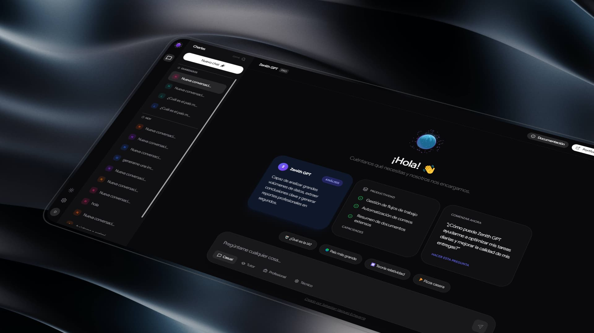

# 🤖 Zenith GPT — Premium Multi-Agent AI Chat Platform

<p align="center">
  
  
  
  
  
  
  
</p>

<p align="center">
  
</p>

---

## 🌟 Overview

**Zenith GPT** is a high-performance, responsive AI conversational platform built with **Next.js (React + TypeScript + Tailwind CSS)** on the frontend and **FastAPI (Python)** on the backend. 

Powered by **LLaMA 3.3 70B** and **LLaMA 3.1 8B** via **Groq**, the application acts as an intelligent middleware orchestrating a multi-agent system. It handles user messages dynamically, deciding whether to search the web in real-time, generate images, compact chat history, or provide a socratic/casual conversation—delivering responses via real-time streaming.

---

## ✨ Features

- ⚡ **Real-Time Streaming:** Progressive token rendering for a natural and immediate typewriter chat experience using Server-Sent Events (SSE).
- 🌐 **Live Web Search Agent (RAG):** Automatically triggers DuckDuckGo searches to retrieve and cite up-to-date real-world facts.
- 🎨 **Generative AI Images:** Seamlessly creates visual prompts and embeds Flux-model images (via Pollinations AI).
- 🎭 **Dynamic Prompt Personalities:** Tailored conversational modes (Casual, Tutor, Professional, Technical) with dedicated UI cues.
- 🧠 **Context & Memory Compression:** Automatic summarization of previous chat context to optimize token usage without losing track of the conversation.
- 🗣️ **Language & Ambiguity Auditing:** Detects user language automatically and prompts for clarification if the input is ambiguous.
- 💾 **Local Chat History:** Securely saves conversations client-side in LocalStorage.
- 🌓 **Premium Dark Mode:** Highly refined dark/light mode interfaces with glassmorphic elements.

---

## 🛠️ Tech Stack

| Layer | Technologies |
| :--- | :--- |
| **Frontend** | Next.js 14+, Tailwind CSS, TypeScript, Framer Motion, Lucide Icons |
| **Backend** | Python 3.11+, FastAPI, Groq SDK, DuckDuckGo Search |
| **AI Models** | LLaMA 3.3 70B (High Power) & LLaMA 3.1 8B (Fast Inferences) |
| **Image Engine** | Flux (via Pollinations AI) |
| **Deployment** | Render (Backend API), Vercel (Frontend Client) |

---

## 🚀 Local Installation

### 1. Clone the Repository
```bash
git clone https://github.com/sebastianvasquezechavarria1234/zenith-gpt.git
cd zenith-gpt
```

### 2. Configure the Backend (FastAPI)
Create a Python virtual environment and install dependencies:
```bash
# Create virtual environment
python -m venv venv

# Activate virtual environment (Windows)
venv\Scripts\activate

# Activate virtual environment (Linux/macOS)
source venv/bin/activate

# Install requirements
pip install -r requirements.txt
```

Create a `.env` file in the root directory:
```env
GROQ_API_KEY=your_groq_api_key_here
```

Start the backend server:
```bash
uvicorn api.main:app --reload
```
The API will run locally at `http://127.0.0.1:8000`.

### 3. Configure the Frontend (Next.js)
Open a new terminal, install dependencies, and start the development server:
```bash
npm install
npm run dev
```
Open `http://localhost:3000` in your browser.

---

## 📡 API Reference

### `POST /ask`
Submit a question with context to receive a streaming text response.

* **Headers:** `Content-Type: application/json`
* **JSON Payload:**
  ```json
  {
    "name": "Sebastian",
    "question": "Explain quantum computing in simple terms",
    "personality": "tutor",
    "history": [
      { "t": "u", "x": "Hello" },
      { "t": "a", "x": "Hello Sebastian! How can I help you today? 📚" }
    ]
  }
  ```

---

## 👤 Author

Developed with ❤️ by **Sebastian Vasquez Echavarria**.

- 🌐 [Portfolio](https://sebas-dev.vercel.app)
- 🐙 [GitHub](https://github.com/sebastianvasquezechavarria1234)

---

<p align="center">
  <i>"Democratizing AI through clean, high-performance architecture."</i>
</p>